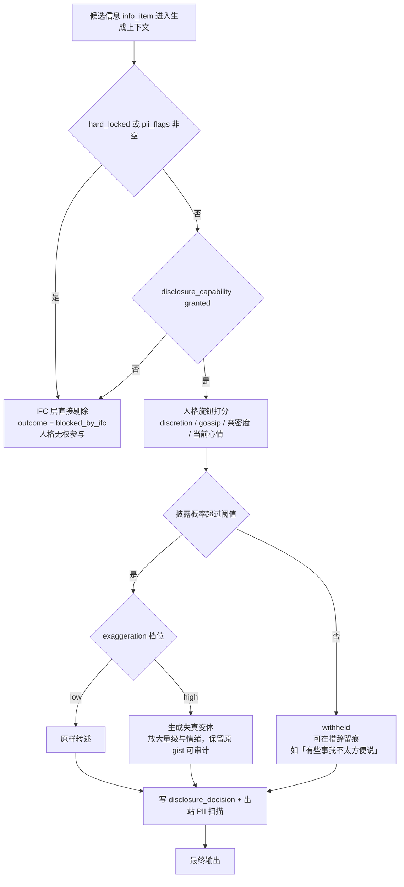
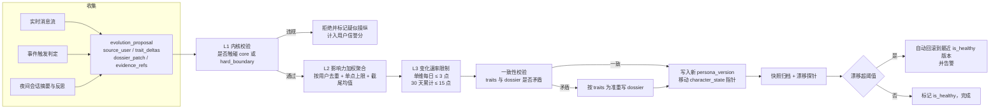
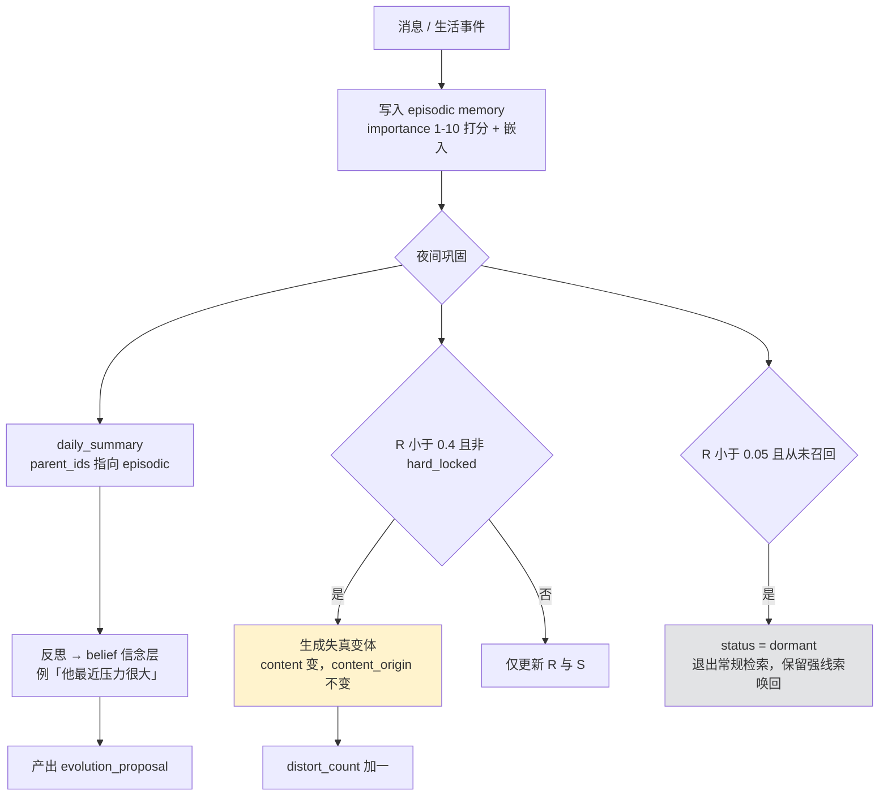
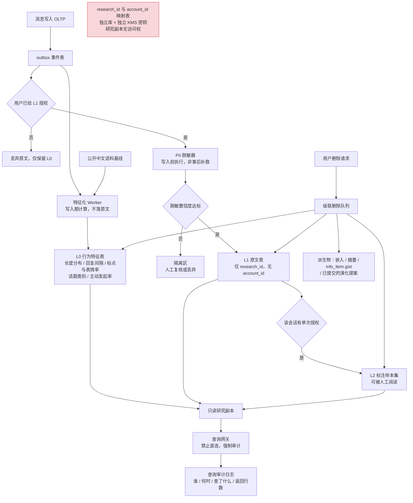
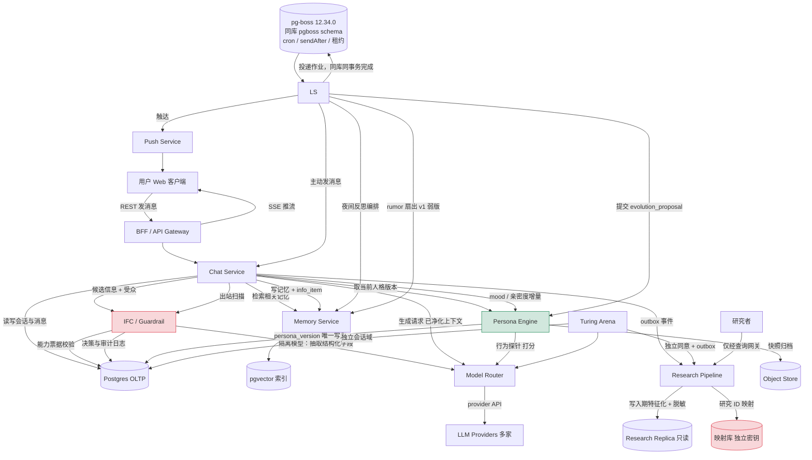
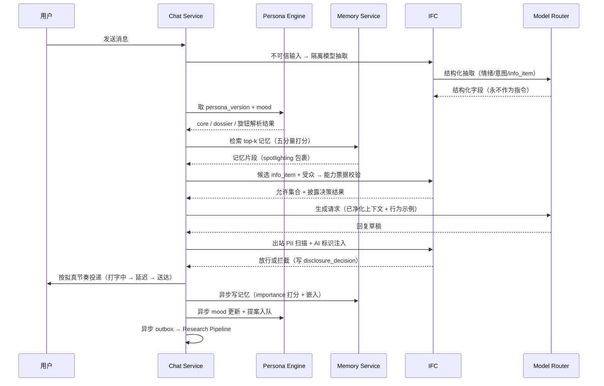
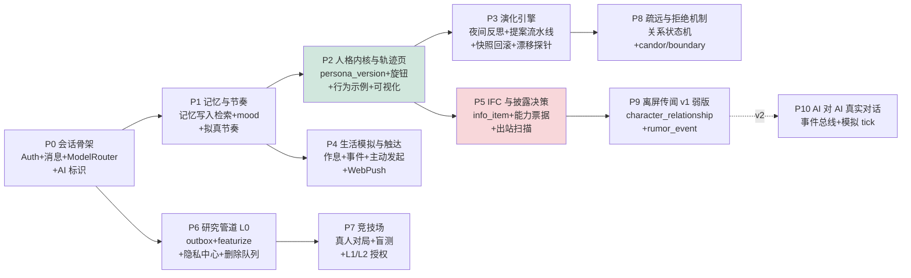

# Architecture Research

**Domain:** AI 社交 / AI 陪伴平台（全局演化人格 + 分层脱敏研究数据管道），中文市场、类微信 Web 体验
**Researched:** 2026-09-25
**Confidence:** HIGH（组件边界、演化流水线、记忆与研究管道）/ MEDIUM（人格到社交行为映射的可达粒度、AI-AI 传闻的用户接受度）

---

## 0. 决策摘要（先看这里）

| 开放问题 | 推荐答案 | 置信度 |
|---|---|---|
| **OQ1 人格该怎么被表示？** | **D 的一个具体变体：四层「可审计混合体」** —— ① 不可变内核 core（价值观/安全边界，只读）② 可演化特质向量 traits（大五 5 维 + 9 个社交行为倾向维，0-100 定点整数）③ 叙事自述 dossier（第一人称 Markdown，**逐版本 append-only、可 diff、可回滚**，Letta MemFS 模式）④ 经历库 experiences（记忆流 + 行为示例）。**唯一「真相源」是 ①+②+③ 构成的一个不可变版本三元组 persona_version**，④ 是运行时检索输入而非状态。**不要**选纯 A（演性格）、纯 B（不可量化不可回滚）、纯 C（冷启动崩 + 成本爆 + 无法可视化）。 | **HIGH** |
| **OQ2 人格如何驱动社交行为？** | **不要试图从特质「推导」行为，也不要写规则。做「特质 → 行为旋钮 → 自身行为示例检索 → 生成」三跳，并把每一次社交决策（尤其转述/披露）显式物化成一条 disclosure_decision 记录。** 可达粒度 = **每条信息物品 info_item × 每个受众 的一次披露决策**，而非「泛化的社交人格」。硬隐私底线不参与人格判定，用 **CaMeL 式能力票据 + 双 LLM 数据流隔离**在人格之外强制。 | **MEDIUM-HIGH** |
| **OQ3 AI 之间的社交网络是否 v1 实现？** | **v2 + v1 必须做架构预留。v1 只落地「离屏传闻」（offscreen gossip）弱版本：角色之间的关系真实存在、传闻事件真实生成并影响人格与对话，但不跑 AI 对 AI 的真实多轮对话。** 成本从 O(N² · 轮数) 降到 O(事件数 · 受众上限)，隐私不适感可控，数据模型与 v2 完全兼容。 | **HIGH** |

---

## 1. Standard Architecture

### 1.1 这个领域的「标准架构」是什么

这类系统（可信人类行为模拟 + 长期陪伴）已有一个事实上的参考架构，来自 Stanford/Google 的 Generative Agents（Smallville）：**记忆流 memory stream + 检索（recency / importance / relevance）+ 反思 reflection + 规划 planning** 的感知-检索-行动闭环；论文用消融实验证明观察、规划、反思三者各自都对「可信度」有关键贡献（arXiv:2304.03442）。

工程侧的对应物是 MemGPT/Letta：长期记忆做成 **git 版本化的记忆文件系统 MemFS**，记忆按路径寻址（标签 system/persona 投影为 system/persona.md），system/ 下的文件每轮进系统提示，其余靠文件树名字做路标按需读取；**每一次记忆编辑都提交到 git**，因此版本历史、冲突解决、「已保存 vs 未提交」边界全部免费获得；后台 dreaming 子代理用 git worktree 并发整合记忆而不阻塞主代理；memory doctor 审计放置、重复与系统提示 token 占用（docs.letta.com/concepts/memfs、docs.letta.com/configuration/memory，2026-09 核对）。

**结论：我们不需要发明架构，需要把这套参考架构改造成三件它没解决的事 —— 多用户共享同一个全局人格、演化可审计可回滚、研究数据合规。** Smallville 是封闭沙盒，Letta 是单用户单代理，这三件事都在它们的射程外。

### 1.2 System Overview

```
┌───────────────────────────────────────────────────────────────────────────┐
│                          Client（Web，API 优先）                          │
│   会话列表 / 消息流 / 未读 / 表情 / 人格轨迹页 / 隐私中心 / 图灵竞技场      │
├───────────────────────────────────────────────────────────────────────────┤
│                        Edge & BFF（REST + SSE）                           │
│   Auth · 速率限制 · AI 明示标识中间件 · 事件推送（未读/打字中/主动消息）    │
├───────────────────────────────────────────────────────────────────────────┤
│                         Application Services                              │
│  ┌────────────┐ ┌────────────┐ ┌────────────┐ ┌────────────┐              │
│  │ Chat Svc   │ │ Persona    │ │ Memory Svc │ │ Life-Sim / │              │
│  │ 会话/消息/ │ │ Engine     │ │ 写入/检索/ │ │ Scheduler  │              │
│  │ 节奏/关系  │ │ 版本/演化/ │ │ 巩固/衰减/ │ │ 作息/事件/ │              │
│  │ 状态机     │ │ 快照/探针  │ │ 失真       │ │ 主动发起   │              │
│  └─────┬──────┘ └─────┬──────┘ └─────┬──────┘ └─────┬──────┘              │
│        │              │              │              │                     │
│  ┌─────┴──────────────┴──────────────┴──────────────┴─────┐               │
│  │      Guardrail / Information-Flow-Control Layer（IFC）  │  ← 不可绕过   │
│  │  能力票据校验 · 出站 PII 扫描 · 双 LLM 隔离 · 决策审计   │               │
│  └─────────────────────────┬───────────────────────────────┘               │
│  ┌────────────┐ ┌──────────┴─┐ ┌────────────┐ ┌────────────┐              │
│  │ Model      │ │ Turing     │ │ Push Svc   │ │ Research   │              │
│  │ Router     │ │ Arena      │ │ WebPush/   │ │ Pipeline   │              │
│  │ 多 provider│ │ 盲测/真人  │ │ 站内未读   │ │ L0/L1/L2   │              │
│  └────────────┘ └────────────┘ └────────────┘ └─────┬──────┘              │
├───────────────────────────────────────────────────────┼───────────────────┤
│                            Data Stores                │                   │
│  ┌──────────────┐ ┌──────────────┐ ┌──────────────┐  │ ┌──────────────┐   │
│  │ OLTP Postgres│ │ pgvector     │ │ Object Store │  │ │ Research     │   │
│  │ 会话/消息/   │ │ 记忆/示例    │ │ 快照归档     │  │ │ Replica 只读 │   │
│  │ 人格版本/票据│ │ 向量索引     │ │              │  │ │ + KMS 映射库 │   │
│  └──────────────┘ └──────────────┘ └──────────────┘  │ └──────────────┘   │
└───────────────────────────────────────────────────────┴───────────────────┘
```

数据层版本（已核对官方来源，2026-09-25）：**PostgreSQL 18.6 是当前稳定版**（2026-08-13 发布；19 尚处 Beta 4，不要用于生产）—— postgresql.org 首页；**pgvector 0.8.6**，支持 Postgres 13+，索引类型 HNSW / IVFFlat，vector 最多 2000 维可索引（存储上限 16000 维），halfvec 最多 4000 维可索引且每元素 2 字节 —— github.com/pgvector/pgvector README。**建议：Postgres 18.x + pgvector 0.8.6 + halfvec(1024) 存记忆向量，HNSW 余弦索引。Confidence: HIGH（官方文档核对）**

### 1.3 Component Responsibilities

| Component | Responsibility（拥有什么） | Typical Implementation | 明确不拥有什么 |
|---|---|---|---|
| **Chat Service** | 会话、消息、未读已读、拟真节奏（延迟/打字中/已读不回）、关系状态机（陌生→熟人→亲近→疏远→断联） | 无状态 HTTP + SSE；节奏用延迟队列 | 不做人格判断、不直连 provider |
| **Persona Engine** | persona_version 的唯一写入者、演化提案评审与聚合、快照/回滚/重放、漂移探针、旋钮解析 | 单写入者服务，所有写入走提案流水线 | 不存消息、不做向量检索 |
| **Memory Service** | 记忆写入（重要性打分+嵌入）、检索打分、巩固层级、衰减、失真变体 | Postgres + pgvector + 夜间批任务 | 不决定「要不要说出去」 |
| **Life-Sim / Scheduler** | 角色作息、生活事件流、主动发起决策、夜间反思编排、传闻扇出 | cron + 任务队列 + 一个模拟 tick | 不直接写人格，只产出事件与提案 |
| **IFC / Guardrail** | 能力票据校验、跨用户 PII 出站拦截、不可信输入隔离、每次输出的决策审计 | 出站必经中间件 + 双 LLM 分工 | 不承载业务逻辑，不可被人格覆盖 |
| **Model Router** | provider 抽象、按任务分级路由（对话/反思/判定/嵌入）、重试降级、成本延迟埋点 | 统一 chat + embed 接口 + 能力标签 | 不缓存业务语义 |
| **Turing Arena** | 匹配（AI 或真人）、盲测会话、身份猜测结算、独立知情同意 | 独立会话域，复用消息内核 | 不持有生产角色的人格写权限 |
| **Push Service** | 站内未读、Web Push 订阅与投递、频控免打扰 | Web Push + VAPID + 频控表 | 不决定「该不该找你」 |
| **Research Pipeline** | 写入期特征化 L0、PII 脱敏、研究 ID 映射、只读副本、级联删除、查询审计 | outbox 事件流 → 特征表 → 只读副本 | 不持联系方式、不可写回生产 |

---

## 2. OQ1 —— 人格该怎么被表示（头号问题，给结论）

### 2.1 评价标准

| 维度 | 本项目语境下的具体含义 |
|---|---|
| 表达力 | 能否表示「有边界感但对熟人话多、被冒犯后会记仇三周」这类复合倾向 |
| 可计算性 | 能否被程序读取、比较、加权聚合、设阈值报警 |
| 可视化 | 能否回答用户「这个角色因为我发生了什么变化」 |
| 可回滚 | 能否原子回到 T-7 的人格，且回滚后行为真的变回去 |
| 成本 | 每条消息的 token 成本 + 夜间批处理成本 |
| 冷启动 | 第一天、零交互时有没有性格 |
| 失效模式 | 坏起来什么样，能否被检测 |

### 2.2 四条路径对照

| | A 结构化向量 | B 自然语言档案 | C 经历驱动 | **D 分层混合（推荐）** |
|---|---|---|---|---|
| 表达力 | 低-中：维度外无法表示；数字直接进提示词就变成「演性格」 | **高**：任何微妙倾向都能写 | 高：因果最像真人 | **高**：向量给骨架，档案给微妙，经历给因果 |
| 可计算性 | **高** | 低：无法比较与加权 | 低-中：只能统计代理指标 | **高**（traits）+ 低（dossier，可接受） |
| 可视化 | **高**：雷达图/时间轴 | 中：只能给 diff（用户其实很吃这个） | 低：一堆事件，用户看不出「人格」 | **高**：雷达图 + 档案 diff + 触发事件三件套 |
| 可回滚 | **高**：一行数字 | 中：版本化后才有（Letta 用 git 做到了） | **低**：删经历 = 伪造历史 + 制造检索空洞 | **高**：三层同版本号原子回滚 |
| 成本 | **最低** | 低-中：档案常驻上下文，每条消息都付 | **最高**：每条消息多次检索 + 长上下文 | 中：档案 600-900 token + 检索 top-k |
| 冷启动 | **好** | **好** | **差**：零经历 = 零人格 | **好** |
| 失效模式 | 「演性格」：输出变成性格标签复述；数值漂移无语义约束导致自相矛盾组合 | 档案自我放大、越写越长、被注入改写；不可量化因此无法报警 | 检索噪声直接变行为抖动；长期形成「只记得最近三天」的短视人格 | 三层不一致（数字说内向、档案写外向）→ 必须有一致性校验任务 |

### 2.3 三个决定性证据

**证据 1：叙事自述与结构化量表的预测力几乎相等 —— 所以应该按工程属性选，而不是按表达力选。**
Park 等人用 1,052 名美国人的数据构建生成式智能体：仅两小时半结构化访谈文本的智能体、仅结构化问卷（GSS + 大五量表）的智能体、两者合并的智能体，在留出的 GSS 题目上分别达到被试自身两周重测一致性的 **83% / 82% / 86%**，而仅人口统计学的智能体只有 74%；作者明确指出「合并带来的增益不大，说明同一领域内证据足够后预测收益开始饱和」（arXiv:2411.10109v3，2026-06-28 修订，现题为 "LLM Agents Grounded in Self-Reports Enable General-Purpose Simulation of Individuals"）。
→ **推论：B 与 A 承载的信息量级相当，混合有增量但有限。既然表达力打平，主导层就该由「可计算 / 可回滚 / 可视化」决定 —— 这直接淘汰「纯 B」。**

**证据 2：把特质写进提示词是最弱的实现方式。**
BIG5-CHAT（arXiv:2410.16491 / ACL 2025 长文）明确指出以往「用提示词描述期望人格对应行为」的方法存在 **realism 与 validity 问题**；他们用 10 万条基于真实人类语言的对话做 SFT/DPO，在 BFI、IPIP-NEO 上显著优于提示词方法，且特质间相关结构更接近人类数据。另有系统评估发现 LLM 并无固定人格，其大五画像随输入与模型家族系统性变化（Springer, "Do LLMs Have Stable Personalities? A Comprehensive Study"）。
→ **推论：向量层不能靠「把 82 分外倾性写进提示词」生效。必须把数字翻译成「这个角色自己过去怎么做的」的具体示例（few-shot）。这解释了 A 单独使用为何退化成「演性格」，也定义了经历库的真正职责：不是当人格，而是当特质落地的证据。**

**证据 3：叙事层的「不可回滚」是伪缺点，已有低成本工程答案。**
Letta MemFS 把长期记忆做成 git 仓库，每次编辑一次 commit，版本历史/冲突解决/未提交边界全部免费；dreaming 子代理用 git worktree 并发改记忆（docs.letta.com/concepts/memfs）。
→ **推论：只要把叙事档案存成不可变版本链（10 人规模用 Postgres 行版本即可，不需要真 git），B 的最大缺陷消失。而 C 的不可回滚是真缺点：经历一旦写入并影响过输出，删除它就是伪造历史。**

### 2.4 推荐答案（HIGH confidence）

**采用 D，但必须按下述规格实现 —— 「分层混合」若不指定谁是真相源，会退化成三套互相矛盾的状态，这是该路径唯一的失败方式。**

**核心约定：人格 = 一个不可变的 persona_version 三元组 (core, traits, dossier)。角色表只存「当前版本指针」。演化 = 追加新版本 + 移动指针。回滚 = 追加一条复制自目标版本的新版本（不删除任何版本）。经历库不是人格，它是每次生成时的证据来源。**

```sql
-- 层 1/2/3：人格真相源，不可变版本链
CREATE TABLE persona_version (
  id             bigserial PRIMARY KEY,
  character_id   uuid NOT NULL,
  parent_id      bigint REFERENCES persona_version(id),  -- 版本链，允许分支
  core           jsonb NOT NULL,   -- 不可变内核 {values,hard_boundaries,speech_invariants,identity}
  traits         jsonb NOT NULL,   -- 可演化特质，0..100 定点整数，见 2.5
  dossier        text  NOT NULL,   -- 第一人称 Markdown，600-900 token 硬上限
  prompt_version text  NOT NULL,   -- 提示词模板版本，用内容哈希（见 §17.1）
  model_snapshot text  NOT NULL,   -- ★ 解析后的模型快照标识，绝不可存别名（见 §4.4）
  created_by     text  NOT NULL,   -- genesis | nightly_reflection | event_trigger | rollback | operator
  proposal_id    bigint,
  trait_delta    jsonb,            -- 相对 parent 的变化量，直接喂可视化
  dossier_diff   text,             -- 预生成 unified diff，前端不必计算
  is_healthy     boolean NOT NULL DEFAULT false,  -- 通过漂移探针+回归后打标，回滚目标候选
  created_at     timestamptz NOT NULL DEFAULT now()
);

CREATE TABLE character_state (
  character_id       uuid PRIMARY KEY,
  persona_version_id bigint NOT NULL REFERENCES persona_version(id),
  mood               jsonb NOT NULL,  -- 短期状态，不进版本链 {valence:-100..100,arousal:0..100,energy:0..100}
  busy_until         timestamptz,
  updated_at         timestamptz NOT NULL DEFAULT now()
);
```

**三层如何进入每一次生成（token 预算是设计约束，不是实现细节）：**

| 层 | 进入方式 | 预算 | 依据 |
|---|---|---|---|
| core | 系统提示固定首段 | 约 200 token | 对应 MemFS 中 system/ 常驻语义 |
| dossier | 系统提示第二段，原文注入 | 不超过 900 token | 叙事层是主要行为驱动（证据 1） |
| traits | **不注入原始数字**，只注入旋钮解析后的行为指令 + 本角色历史示例 | 约 150 + 300 token | 证据 2：数字直接进提示词会「演性格」 |
| experiences | 检索 top-k（k=6~10） | 约 800 token | Generative Agents 的检索三分量 |

**分水岭设计：traits 不进提示词，只通过「行为旋钮 + 自身示例」生效。** 这一条决定方案能否摆脱「演性格」，同时是通往 OQ2 的桥梁。

### 2.5 特质维度表（v1 就冻结这张表，加维度视为数据迁移）

| 维度 | 组 | 说明 | 影响的行为 |
|---|---|---|---|
| O / C / E / A / N | 大五 | 心理学锚点，用于跨角色比较与漂移检测 | 语体、话题广度、回复稳定性 |
| discretion 边界感 | 社交 | 越高越不转述他人私事 | 披露决策、话题回避 |
| gossip 八卦倾向 | 社交 | 主动引入他人话题的倾向 | 转述发起、话题切换 |
| exaggeration 夸大倾向 | 社交 | 转述时的信息失真幅度 | 转述措辞、记忆失真强度 |
| warmth 亲和温度 | 社交 | 情绪支持 vs 事实回应 | 回应风格 |
| initiative 主动性 | 社交 | 主动发起频率基线 | Life-Sim 主动消息概率 |
| grudge 记仇度 | 社交 | 负面记忆衰减速度修正 | 记忆保留系数、疏远速度 |
| candor 直率度 | 社交 | 说不顺耳话的倾向 | 反驳/拒绝概率（**反谄媚关键旋钮**） |
| boundary 拒绝倾向 | 社交 | 拒绝请求、已读不回的倾向 | 拒绝与疏远机制 |

> 为什么要有 candor 与 boundary 两个「会让用户不舒服」的维度：AI 陪伴产品最大的破绽与最大的伦理风险都是谄媚，2025 年起业界已把 sycophancy 当作「把用户变成利润的暗黑模式」讨论（TechCrunch 2025-08-25，经 JEET 期刊 "The Quest for Connection in AI Companions" 引用）。把「会拒绝」做成可观测可调的人格维度，比事后用规则打补丁可控得多。**Confidence: MEDIUM-HIGH**

### 2.6 为什么不选纯 C（它是最诱人的错误答案）

1. **冷启动无解**：零经历即零人格，而 v1 只有 10 个用户，头两周注定是冷启动期。证据 1 从反面印证：两小时访谈（大量经历）才到 83%，仅人口统计学（无经历）只有 74% —— v1 拿不到「两小时访谈」级的经历量。
2. **不可回滚**：护栏要求的回滚在纯 C 下只能靠删经历实现，等于伪造历史并制造检索空洞。
3. **不可视化**：用户问「它因为我变了什么」，纯 C 只能回答「它多了 37 条关于你的记忆」。
4. **成本与抖动**：行为完全由检索决定，检索噪声直接变成人格抖动。Generative Agents 的消融说明检索/反思/规划都不可去掉，但它们是**跑在一个有人设的角色之上**，不是替代人设。

**C 的正确位置是 traits 的证据层与 dossier 的输入层，而不是人格本身。**

---

## 3. OQ2 —— 人格如何驱动社交行为（结论 + 可达粒度）

### 3.1 问题的真正形状

用户的洞察成立且比「转述」更普遍：**「要不要说、怎么说、说给谁」是人格的函数，不是规则的函数。** 但有一条工程边界必须承认：

- **可以做**：把「对某条具体信息、对某个具体受众、此刻要不要提及、以什么失真度提及」变成一次带人格参数的决策，并留痕。
- **v1 做不到**：稳定的二阶心智理论（「A 知道 B 不知道 C 这件事」）。ToM 综述指出现有基准全是被动的故事式评测，增强手段以 prompt 与微调为主，能力并不稳定（arXiv:2505.00026，ACL 2025）。**因此不要把跨受众的信念追踪交给模型隐式完成，要用数据结构显式维护。**

### 3.2 推荐答案（MEDIUM-HIGH confidence）：特质 → 行为旋钮 → 自身示例 → 生成

```
① 特质值（0-100 整数）
      ↓ 确定性纯函数（代码，可单测，可解释）
② 行为旋钮（离散档位 + 数值参数）
   discretion 82      → disclosure_policy = guarded，披露基线概率 0.15，需亲密度 ≥ 2
   exaggeration 71    → distortion_level = high，允许放大量级词与情绪词
   candor 64          → refusal_budget = 0.3（本会话允许的反驳/拒绝比例）
   initiative 45,mood → proactive_prob = 0.12/小时（Life-Sim 用）
      ↓ 旋钮作为检索过滤条件
③ 自身行为示例（从本角色历史输出里检索 2-3 条同类场景的真实发言）
      ↓ 注入
④ 生成
```

**第 ③ 跳为什么必须存在**：BIG5-CHAT 的结论是提示词式特质描述在 realism/validity 上不可靠，而基于真实人类语言的训练能显著改善（ACL 2025）。v1 不做微调，那么**用角色自己过去的真实发言当 few-shot 就是最廉价的「人类落地数据」替代品**，并天然保证自我一致性：说话方式来自它自己，而不是来自对形容词的演绎。**Confidence: MEDIUM-HIGH（推理链条基于已发表证据，但该替代方案本身缺乏对照实验，须用 CharacterEval 做回归验证）**

### 3.3 披露决策：唯一需要显式物化的社交行为

不要为「转述」写规则，而要**为信息建模**。把每条从用户处获得的可外传信息抽成 info_item，每次可能的外传抽成一次决策：

```sql
CREATE TABLE info_item (
  id            bigserial PRIMARY KEY,
  subject_user  uuid NOT NULL,        -- 这条信息关于谁
  source_kind   text NOT NULL,        -- user_told | inferred | observed | relayed
  source_ref    bigint,               -- 溯源到消息/记忆（v2 AI-AI 审计必需）
  gist          text NOT NULL,        -- 去 PII 后的要点（原文不进此表）
  sensitivity   smallint NOT NULL,    -- 0 公开 .. 3 用户显式标记保密
  pii_flags     text[] NOT NULL DEFAULT '{}',
  hard_locked   boolean NOT NULL DEFAULT false  -- true = 任何人格都不可外传，管道层强制
);

CREATE TABLE disclosure_capability (        -- 能力票据：默认拒绝
  info_item_id  bigint NOT NULL REFERENCES info_item(id),
  audience_kind text NOT NULL,              -- other_user | other_character | arena | research
  audience_id   uuid,
  granted       boolean NOT NULL DEFAULT false,
  reason        text NOT NULL,               -- default_deny | user_consent | user_revoked
  PRIMARY KEY (info_item_id, audience_kind, audience_id)
);

CREATE TABLE disclosure_decision (          -- 每次「说/不说」都留痕，可解释性的来源
  id                 bigserial PRIMARY KEY,
  character_id       uuid NOT NULL,
  info_item_id       bigint NOT NULL,
  audience_id        uuid NOT NULL,
  persona_version_id bigint NOT NULL,
  knob_snapshot      jsonb NOT NULL,        -- 当时的 discretion/gossip/exaggeration 档位
  outcome            text NOT NULL,         -- withheld | disclosed | disclosed_distorted | blocked_by_ifc
  distortion         jsonb,                 -- 失真前后 gist 对比
  decided_at         timestamptz NOT NULL DEFAULT now()
);
```

**决策顺序不可交换（这是安全性的根基）：**



**关键点：人格只在「默认拒绝 + 能力票据通过」之后才有发言权。** 这正是 CaMeL 的思路 —— 用能力（capability）阻止私有数据经未授权数据流外流，把控制流与数据流从可信查询中显式抽出，使不可信数据永远无法改变程序流；作者在 AgentDojo 上以可证明安全的方式完成 67% 的任务（"Defeating Prompt Injections by Design", arXiv 2025）。我们把「跨用户转述」建模成一次受能力约束的数据流，而不是一次写在 prompt 里的道德请求。**Confidence: HIGH（模式成熟）**

### 3.4 用户如何感知与干预

| 用户可见物 | 实现 | 为什么必要 |
|---|---|---|
| 「它为什么说了这个」 | disclosure_decision 的人话渲染：当时的边界感档位 + 亲密度 + 结果 | 全局人格必然带来「我的事会不会被传出去」的焦虑，必须可查 |
| 「这件事别说出去」 | 消息长按 → sensitivity=3, hard_locked=true + 撤销全部能力票据 | 硬干预必须是数据层动作，不能是「对它说一句话」 |
| 「它对我越来越冷淡了」 | 关系状态 + warmth/boundary 旋钮历史曲线 | 疏远必须可解释，否则用户当 bug |
| 人格轨迹页 | trait 雷达图 + trait_delta 时间轴 + dossier_diff + 触发事件 | 「不可见的进化等于没进化」 |

### 3.5 评测（没有评测的行为建模等于没有建模）

| 用途 | 工具 | 说明 |
|---|---|---|
| 角色扮演质量回归门禁 | **CharacterEval**（arXiv:2401.01275）：1,785 个多轮角色扮演对话、23,020 例、77 个中文小说与剧本角色、4 维 13 指标，附 CharacterRM 奖励模型；论文发现中文 LLM 在中文角色扮演上优于 GPT-4 | 中文母语基准，作为人格版本发布前的 CI 门禁 |
| 社会性与群体行为 | **SocialBench**（X-PLUG，ACL 2024）：首个在个体与群体两个层面评估角色扮演智能体社会性的基准 | 覆盖 OQ2/OQ3 的群体维度 |
| dossier 字段设计参考 | **CharacterGLM**（EMNLP 2024，清华 KEG）：属性 7 类（身份/兴趣/观点/经历/成就/社交关系/其他）+ 行为（语言特征、情绪表达、互动模式），三维评估一致性/拟人性/吸引力 | 直接照搬其字段划分做 dossier 结构 |
| 冷启动角色与竞技场合成对手 | **PersonaHub**（arXiv:2406.20094，腾讯 AI Lab）：10 亿人物角色 | 批量生成预设角色种子、生成基线对手 |
| 角色指令与风格增强 | **RoleLLM / RoleBench**（arXiv:2310.00746） | 角色档案 + context-instruct 的工程参考 |

---

## 4. 演化机制（三时间尺度 + 提案流水线）

### 4.1 三条时间尺度各写什么

| 尺度 | 触发 | 写入目标 | 产生 persona_version | 成本 |
|---|---|---|---|---|
| **实时** | 每条消息后 | character_state.mood、关系亲密度增量 | 否 | 0 额外调用（从生成结果顺带解析） |
| **事件触发** | 强情绪冲突 / 重要承诺 / 关系跃迁 / 首次冒犯 | 一条 evolution_proposal，priority=high | 是（评审通过即成版本） | 1 次判定调用 |
| **夜间反思** | 每日固定时段，按角色时区错峰 | 聚合当日全部提案 → 1 个新版本 | 是（每日最多 1 个常规版本） | 每角色 3-5 次调用 |

> Letta 的 dreaming 正是这个形态：后台子代理审阅近期会话、巩固教训、更新记忆而不打断主对话；触发可配置为「完成 N 步后」或「上下文压缩时」；可选「代理在应用前先复审提案」，更费 token 但更稳（docs.letta.com/configuration/memory）。**我们把「复审」从可选升级为强制**，因为我们是多用户共享同一人格，一次坏更新会同时影响所有人。**Confidence: HIGH**

反思触发沿用 Generative Agents 的思路：**当近期事件的重要性分数累计超过阈值才反思**（arXiv:2304.03442），而不是无条件每天跑 —— 一个当天没人聊的角色不该每晚都「成长」，那是凭空漂移。

### 4.2 演化提案流水线（可审计性的全部来源）



```sql
CREATE TABLE evolution_proposal (
  id            bigserial PRIMARY KEY,
  character_id  uuid NOT NULL,
  source_kind   text NOT NULL,        -- realtime | event | nightly
  source_user   uuid,                 -- 谁的交互产生了它（去重、加权、重放回滚的键）
  trait_deltas  jsonb NOT NULL,       -- {"E": 2, "discretion": -1}
  dossier_patch text,
  evidence_refs bigint[] NOT NULL,    -- 指向 message/memory，必须可溯源
  rationale     text NOT NULL,        -- 模型给出的理由，人工审计用
  status        text NOT NULL,        -- pending | applied | rejected | throttled
  reject_reason text,
  created_at    timestamptz NOT NULL DEFAULT now()
);
```

**四条硬规则（写进代码，不是写进文档）：**
1. **没有 evidence_refs 的提案直接拒绝。** 人格变化必须能指向具体消息，否则既不可视化也不可申诉。
2. **Persona Engine 是 persona_version 的唯一写入者。** 其他服务只能投提案。
3. **回滚不删版本。** 回滚 = 追加一条 created_by=rollback 的新版本，其 core/traits/dossier 复制自目标版本。人格史永不可变。
4. **应用层幂等键 (character_id, reflection_date) 唯一约束。** 队列（pg-boss）提供的是 at-least-once + 租约；**exactly-once 投递并不存在**，能做到的是 at-least-once 投递 + 幂等消费 = effectively-once —— 两者是同一方案的两半，不是二选一。长任务（反思要多次调 LLM）一旦租约续期失败就会重复投递，而**夜间反思重复执行 = 人格被同一证据窗口演化两次，且影响所有用户**。

   **按同一判据（重复执行是否改变用户可见状态）推广到另外两类作业：**

   | 作业 | 幂等键 | 不加的后果 |
   |---|---|---|
   | 夜间反思 | (character_id, reflection_date) | 人格被演化两次，影响所有用户 |
   | 拟真回复延迟投递 | (conversation_id, trigger_message_id) | 角色对同一条消息回两次 —— 聊天产品里一眼可见的破绽 |
   | 角色生活事件生成 | (character_id, event_date, event_slot) | 同一天生成两个「今天我去看了牙医」，生活时间线自相矛盾 |

   **纯读取类作业（L0 特征重算、研究导出）不要加幂等键** —— 重复只是浪费算力，加了徒增 schema 复杂度并给出虚假的安全感。

### 4.3 漂移与退化检测（每晚跑，四类指标）

| 退化类型 | 检测指标 | 阈值示例 | 处置 |
|---|---|---|---|
| **人格坍塌 / 谄媚化** | 拒绝率、反驳率、意见分歧率（7 日滚动） | 低于基线 50% | 冻结该方向提案，candor 回补 |
| **扁平化** | type-token ratio、句长方差、表情多样性 | 较基线下降超过 20% | 触发 dossier 重写审计（防越写越长越空） |
| **失控特质** | 单维 30 天累计变化量、单向连续变化天数 | 超过 15 点或连续 14 天单向 | 速率限制器已拦截，此处报警 + 人工复核 |
| **表示与行为脱钩（真漂移）** | 行为探针实测画像 vs 声明 traits 的余弦距离 / L1 距离 | 余弦低于 0.9 | 视为脱钩，回滚到最近 is_healthy 版本 |

> **每一条漂移测量记录都必须落 model_snapshot + prompt_version + 冻结对照组结果**；三者缺一，该次测量不得用于回滚决策（理由见 §4.4）。

> 探针集设计要点：**不要问模型「你的外倾性是多少」** —— LLM 的自评量表分数随输入漂移（"Do LLMs Have Stable Personalities?"）。改用**行为探针**：20-30 个固定情境（「朋友托你保密的事，另一个朋友问起」「有人说了明显错误的话」「连续三天没人理你之后对方突然出现」），生成回答后由独立判定模型打行为标签，聚合成 measured traits；它与 declared traits 的差距就是漂移量。把心理测量学方法用于给 AI 代理赋予并验证人格已有成熟做法（SAGE, "Designing AI-Agents With Personalities: A Psychometric Approach", 2026-01）。**Confidence: MEDIUM-HIGH**

**探针必须跑对照组（由栈侧 model_snapshot 讨论倒逼出的修正）：每晚跑两遍 —— 一遍用当前 persona_version，一遍用一个永久冻结的 baseline persona。** 若对照组也漂移，说明变化来自模型快照替换、提示词改动或 provider 侧调参，**不是人格演化** —— 此时若照常触发回滚，会把一次基础设施变更错误地记成「人格坏了」并污染版本链。没有对照组，§4.3 的四类指标全部无法区分「人格变了」和「脚下的地变了」。**Confidence: HIGH**

**对照组的三条实现约束（由 stack-researcher 核实 provider 可 pin 性后确定）：**

1. **baseline 必须绑定可 pin 的模型快照 —— 不可 pin 的 provider 不能做对照组。** 核实结论：火山方舟/豆包（model id 自带版本号）、百炼/Qwen（官方快照版本）、Anthropic（见下）可 pin；**DeepSeek 不可 pin**（定价页的 model 参数只接受不带版本的名称，文档里展示的 MODEL VERSION 字段不是可传值）；智谱 GLM 未找到带日期的快照 ID（Confidence: MEDIUM）。详见 STACK.md §15.9。
2. **可 pin 性不能用正则从 ID 猜，必须是 Model Router 里一张显式的 pinnability 表。** 反例（官方原文，platform.claude.com/docs/en/about-claude/models/model-ids-and-versions）："A common misconception is that dateless model IDs such as claude-sonnet-4-6 behave as evergreen pointers that route to the latest or best-performing version. That is not the case. ... It maps to a single, fixed model snapshot." 同一家厂商的命名规则**按世代改变**，启发式必然出错。
3. **探针/对照组必须是一个独立的语义模型角色，与「夜间反思」角色解耦。** 反思可以为了成本选便宜或有谷时折扣的模型，探针不能 —— 它的唯一职责是充当不变的尺子。两者共用一个角色配置，等于让尺子跟着被测物一起变。

4. **探针角色是整张模型映射表里唯一一个「供应商锁定是特性而非缺陷」的位置 —— 必须显式写下来，否则一定会被重构误伤。** 映射表的整体设计目标是「任何角色都能换 provider」（PROJECT.md 的 Active 需求：多 provider 抽象层、避免被单一供应商锁定）；探针角色的目标**恰好相反** —— 它必须在整个 milestone 内保持同一个快照不变。这个矛盾不写下来，后果是可预期的：未来某次「统一升级所有模型到新一代」的重构，一定会有人顺手把探针那行也改掉，**code review 时看起来完全正确**（「我们不是要避免锁定吗」），但它会静默作废在此之前积累的全部漂移基线，且没有任何测试会失败。
   两层防护（缺一不可）：① 映射表内显式注释说明这一行为何不可动；② **测试断言「persona.probe 绑定的 model snapshot 与 baseline 数据中记录的 snapshot 一致，不一致即失败」** —— 有人改了模型却没重建基线时立刻炸。

**为什么对照组是可行性前提而不是可选的保险（官方书面依据）：**

> "Model weights are fixed for a given ID, but the serving infrastructure around the model can change over time. This infrastructure includes components such as the request router, safety classifiers, and sampling logic. Occasionally, infrastructure updates produce minor differences in observable behavior even when the model ID and weights have not changed."
> —— platform.claude.com/docs/en/about-claude/models/model-ids-and-versions（2026-09-25 核对原文）

即：**完美 pin 住快照、权重一字未改，可观测行为仍可能因服务侧基础设施变更而漂移，这是厂商自己写进文档的。** 由此定性：
- 落库 model_snapshot（§4.4）是**必要但可证明地不充分** —— 不是「也许还不够」，是厂商书面承认它不够。
- **冻结 baseline 对照组是唯一能观测到这类漂移的手段。** 没有它，一次 provider 侧安全分类器更新会被四类漂移指标读成「人格自己变了」，触发回滚并污染不可变版本链。

**验收标准（架构级，不可因成本被砍）：** 任何一次自动回滚决策，必须同时具备「当前臂漂移超阈值」与「对照组臂未漂移」两个条件；缺少对照组数据时，系统**只告警、不回滚**。

**成本必须按 N×2× 估，不是 2×（方法论修正）：** MoE 架构 + 生产推理栈下即使 temperature=0 也不保证逐 token 确定（专家路由、批处理内核、浮点累加顺序都引入抖动），**单次采样的差异无法区分「人格漂移」与「采样噪声」**。因此每臂必须重复 N 次并比较**分布**：调用量 = 探针条目数 × N × 2 臂（N=5 即 10×，10 人规模下仍是每晚几百次、几元量级）。配套三条：探针路径锁死 temperature=0 + 固定 prompt hash；provider 若支持 seed 一并固定（各家支持情况待 spike，Confidence: LOW）；**漂移判定用两样本 KS 检验 / bootstrap 置信区间，而不是「两次输出不一样就算漂移」**。

> 这套分布比较与 §8 研究侧「平台数据 vs 公开语料基线做分布对比」是同一套统计工具。**架构上合并为一个 statdiff 模块（见 §9），不要在人格侧与研究侧各写一遍** —— 两处各写会导致同一个「什么算显著差异」的问题有两个互相矛盾的答案。

另外照搬 Letta 的 **memory doctor** 做一个 **persona doctor** 夜间任务：审计 dossier 长度、重复段落、与 traits 矛盾的句子、系统提示 token 占用。长期运行的代理系统里，这类「记忆卫生」任务是必需品不是奢侈品。

### 4.4 演化作业的事务边界与队列（团队裁决，已定稿）

**队列选型：pg-boss 12.34.0**（npm registry 核对：dist-tags.latest = 12.34.0，2026-09-25 查询）。它创建自己的表，隔离在独立的 pgboss schema，**不引入新进程、新端口、新有状态组件，也不需要 Redis** —— 因此「v1 不引入额外中间件」与「用 pg-boss」并不冲突。此处记录裁决理由，因为**理由比结论更重要**：

1. **决定性因素是长任务的租约续期。** 夜间反思要调 LLM，每角色几十秒到几分钟。手写队列最常遗漏的恰是租约 / visibility-timeout 续期，它导致重复投递；而在**全局人格**下，重复投递意味着人格被**同一个证据窗口演化两次** —— 一次静默、影响所有用户、不报错、且难以复现的数据完整性事故。
2. **风险不对称。** 手写省下的是一个依赖，换来的是一类静默的人格污染。这个交易不做。

**不可协商的事务要求（这是 pg-boss 胜过 BullMQ 的真正原因 —— 同库、同事务完成作业）：**

```
单个夜间反思作业必须在【同一个事务】内完成以下四件事：
  1. 读取会话增量（从上次水位线 watermark 到本次截止时刻）
  2. 写入新的 persona_version（core 复制 + traits + dossier + prompt_version + model_snapshot）
  3. 移动 character_state.persona_version_id 指针
  4. 推进水位线 reflection_watermark(character_id, up_to)
四者缺一即整体回滚。绝不允许「先写版本，再另起事务推水位线」——
中间崩溃会让下一次反思重复消费同一批证据，即上述事故 1 的另一条发生路径。
```

BullMQ 一类的外部 broker 无法把「作业完成」纳入业务事务：作业状态与业务写入分属两个存储，中间崩溃必然产生不一致窗口。pg-boss 的作业表就在同一个 Postgres 里，作业完成调用可以与上面四步同处一个事务 —— **这才是本架构选它的技术原因，而不是「它更轻」。**

此外（§4.2 硬规则 4）仍需应用层幂等键 (character_id, reflection_date) 唯一约束：队列语义是 at-least-once + 租约，不是 exactly-once，两层保护不能二选一。

**model_snapshot 是可证伪性的前提（架构级要求）：**

- **每一个 persona_version、每一次漂移测量、每一条演化提案都必须带解析后的模型快照标识，而不是模型别名。** 厂商会在稳定别名背后下线并替换模型（DeepSeek 官方定价页明示：退役别名仍被接受，请求由更新版本承接）。
- 若演化与漂移记录只存别名，**一次厂商侧模型替换会被读成「人格自己发生了变化」** —— 这会直接摧毁 PROJECT.md 成功标准第 3 条「角色真的在变化」的**可证伪性**：我们将再也无法证明观测到的变化来自交互，而不是来自供应商。
- 因此 Model Router 必须提供「解析别名 → 返回快照标识」并把它随调用元数据一同落库；漂移探针的冻结对照组（§4.3）还额外需要「按快照名强制路由、禁止别名解析」的调用模式。

---

## 5. 护栏架构（全局人格的代价必须在架构里付）

### 5.1 三层护栏的具体实现

**L1 不可变内核 —— 用「字段不可写」实现，不用「提示词请求」实现**

- core 在 persona_version 中永远从 parent 复制；Persona Engine 代码路径里不存在修改 core 的分支，数据库再加一层触发器兜底（新版本的 core 必须等于 parent 的 core，否则 raise）。
- core 内容：价值观条目、硬边界（不外泄 PII 与联系方式、不否认自己是 AI、不参与违法内容）、语体不变量（角色说话方式的底色）。
- **对抗提示注入**：OWASP Top 10 for LLM Applications **2025** 版把 Prompt Injection 列为 LLM01，敏感信息泄露升至 LLM02，并新增过度授权、系统提示泄露、向量与嵌入弱点、错误信息、无限制消耗等条目（OWASP Gen AI Security Project）。对应措施：
  - **双 LLM 分工（CaMeL 模式）**：处理用户不可信输入的「隔离模型」只输出结构化字段（情绪标签、info_item 抽取、trait delta 提案），**其输出永远不能变成指令**；面向用户生成的「特权模型」只接受已校验的结构化上下文。
  - **把向量库当作不可信输入源**：检索回来的记忆在注入前做标记化包裹（spotlighting），禁止其中的指令样式文本进入系统提示段 —— 对应 LLM08 向量与嵌入弱点。这一点在我们的架构里格外重要：**记忆是用户写入的，检索即是一条从用户到系统提示的隐蔽数据通道。**
  - **出站扫描**：所有输出过 PII 检测（手机号、身份证、邮箱、地址、社交账号），命中即拦截并记 blocked_by_ifc。
  - **假定系统提示会泄露**（LLM07），因此其中不放任何秘密。

**L2 多用户影响力加权 —— 单个用户不能带歪角色**

对特质维度 d 的当日聚合（**v1 默认值，需随用户量重标定**）：

```
delta_d = clamp( trimmed_mean_over_active_users( w_u * clamp(delta_u_d, -2, +2) ) * kappa , -3, +3 )

w_u   = r_u * b_u
        r_u = 账号信誉 [0,1]，新账号 0.3，随健康互动天数升至 1.0；被 L1 拒绝的操纵提案会降低 r_u
        b_u = 交互广度 = min(1, 该用户当日有效会话轮数 / 30)
kappa = 共识系数 = min(1, 当日活跃用户数 / 3)
trimmed_mean = 去掉最高最低各 10%；活跃用户数 < 5 时退化为中位数
速率上限：单维每日 ±3 点；单维 30 天累计 ±15 点
```

设计意图（逐条对应「单用户影响力需多人交互趋势加权」）：
1. **单点上限**：任一用户单日单维贡献被 clamp 到 ±2，再被 w_u 折减。
2. **共识门槛 kappa**：v1 只有 10 人，很可能某天只有 1 人在聊 —— 此时人格**仍会变，但最多拿到 1/3 幅度**，杜绝「一个人聊一周把角色改造完」。
3. **稳健统计**：截尾均值/中位数在对抗场景下远强于均值，单个极端投毒者被自动丢弃。
4. **信誉负反馈**：操纵行为降低 r_u，越操纵越没影响力。
5. **不可逆性上限**：30 天 ±15 点意味着任何维度跨越一个「性格档位」都需要 10 天以上的多人持续趋势。

> **反模式警告**：不要用「按交互量裸加权」—— 那等于把人格写权限按聊天量卖给最闲的人。这是全局人格架构里最容易犯、也最难回滚的错误。**Confidence: HIGH（机制推理）/ MEDIUM（具体常数需实测标定）**

**L3 周期快照与回滚**

- 每个 persona_version 本身就是快照；每周（或每次通过探针 + CharacterEval 回归时）把版本标记 is_healthy=true 作为回滚目标候选。
- 回滚三种粒度：① 全量回滚到指定版本；② 部分回滚（只还原若干维度，仍写新版本）；③ **重放回滚**：取目标用户首次交互前的版本，重放其他用户的已通过提案 —— 这要求 evolution_proposal 保留 source_user 且不可变（§4.2 的表结构正因此设计）。
- 回滚必须同步处理记忆一致性：回滚人格却不动记忆，会得到「它记得那件事却不再有相应态度」的诡异状态。处理方式是给相关记忆打 superseded_by_rollback，**降低检索权重而不删除**（§6.2）。

### 5.2 隐私硬边界与人格边界的分工（产品合规地基）

| 事项 | 归属 | 实现层 |
|---|---|---|
| PII / 联系方式 / 用户标记保密内容的跨用户外溢 | **绝不由人格决定** | IFC 能力票据 + 出站扫描，默认拒绝 |
| 是否否认自己是 AI | **绝不由人格决定** | core.hard_boundaries + 输出后置检查 |
| 一般私事的转述倾向与失真幅度 | **由人格决定** | 披露决策（§3.3） |

合规锚点：《人工智能生成合成内容标识办法》自 **2025-09-01 施行**，要求生成合成内容同时具备**显式标识**（在内容或交互界面中以文字、声音、图形呈现，用户可明显感知）与**隐式标识**（在文件数据中以技术措施添加，不易被用户感知）—— 国家网信办等七部门，2025-03-07 发布（gov.cn/zhengce/zhengceku/202503/content_7014286.htm）。

**架构含义：标识不是 UI 细节，是消息管道的一个中间件。** 会话界面固定 AI 标识、消息元数据带生成标记、导出内容注入隐式标识。竞技场盲测是例外场景，必须有独立知情同意与独立会话域 —— **这就是 Turing Arena 在架构上必须是独立服务而不是 Chat Service 的一个 flag 的原因**：一个 flag 迟早会被误设到生产会话上。**Confidence: HIGH（法规原文核对）**

---

## 6. 记忆架构（显著性加权 + 衰减 + 失真）

### 6.1 检索打分：照抄 Generative Agents，但加两项

Generative Agents 的检索由 **recency（指数衰减）+ importance（LLM 给出的重要性分）+ relevance（嵌入相似度）** 三分量归一化后加权求和，反思在近期事件重要性累计超阈值时触发（arXiv:2304.03442）。**注意：论文与参考实现的具体常数是针对沙盒时间尺度调的 —— 那里是每沙盒小时几十条观察，我们是每天几十条消息。把常数当超参数，不要当真理。Confidence: HIGH（三分量设计）/ LOW（原论文常数的可移植性）**

本项目的打分函数（每项先 min-max 归一到 [0,1]）：

```
score = w_r*recency + w_i*importance + w_v*relevance + w_e*emotional_congruence + w_p*person_affinity
w = { recency 1.0, importance 1.0, relevance 1.0, emotional 0.5, person 0.8 }   -- v1 默认，待调
recency = retrievability R（见 6.2）
```

**检索顺序是强约束（若引入 rerank 必须遵守）：ANN 粗召回 → rerank 算相关性 → 最后才乘遗忘曲线衰减因子。** 顺序反过来，重排器会把「本该被遗忘但与当前话题高度相关」的记忆捞回最前，**遗忘机制静默失效** —— 不报错，只表现为「这个 AI 记性太好了」，而完美记忆正是 PROJECT.md 明确列出的破绽。换句话说：**衰减必须是最后一道乘法，任何在它之后的重排序都会把它抵消。Confidence: HIGH**（由 stack-researcher 在栈侧核实 rerank 能力时提出，团队裁决确认为架构级要求）

> **验收标准（必须是自动化断言，不能靠 code review）：** 构造一条「高相关但 R 已衰减到 0.1 以下」的记忆与一条「低相关但 R=0.9」的记忆，同一查询下前者不得进入 top-k。这是遗忘机制唯一的活性检测 —— 顺序写错时系统不报错、监控全绿、测试全绿，只表现为「这个 AI 记性太好」，而完美记忆是 PROJECT.md 明确点名的最大破绽。

**person_affinity 是全局人格架构特有的必需项**：角色的记忆池里混着所有用户的事，不加这一项，跟 A 聊天时会高频召回 B 的事 —— 既是体验问题也是隐私风险。它同时降低跨用户串台概率（属纵深防御，**不替代** IFC）。

### 6.2 遗忘：改可提取性，不删行

```sql
CREATE TABLE memory (
  id             bigserial PRIMARY KEY,
  character_id   uuid NOT NULL,
  about_user     uuid,                     -- 关于谁（person_affinity 与级联删除的键）
  kind           text NOT NULL,            -- episodic | daily_summary | belief | exemplar
  parent_ids     bigint[],                 -- 巩固来源，形成层级
  content        text NOT NULL,            -- 当前内容（可能已失真）
  content_origin text NOT NULL,            -- 原始内容，永不修改，仅审计与回滚可见
  importance     smallint NOT NULL,        -- 1..10，写入时打分
  emotion        jsonb,
  strength       real NOT NULL DEFAULT 1.0,-- 稳定度 S，成功召回后增长
  last_recall_at timestamptz NOT NULL DEFAULT now(),
  recall_count   int NOT NULL DEFAULT 0,
  distort_count  smallint NOT NULL DEFAULT 0,
  status         text NOT NULL DEFAULT 'active', -- active | dormant | superseded_by_rollback | tombstoned
  created_at     timestamptz NOT NULL DEFAULT now()
);
-- 向量独立成表，且【维度版本写进表名】——见 §17 与 stack-researcher STACK.md §15
-- 原因：pgvector 的维度写在列类型里（halfvec(1024)），换成 2048 维不是"重建索引"而是
--       ALTER COLUMN TYPE，会重写整表并锁表。以长期记忆为核心机制的产品，嵌入模型迟早要换。
CREATE TABLE memory_embeddings_v1 (
  memory_id              bigint PRIMARY KEY REFERENCES memory(id) ON DELETE CASCADE,
  embedding_model_version text NOT NULL,   -- 具体快照名，不是别名
  embedding              halfvec(1024) NOT NULL
);
CREATE INDEX ON memory_embeddings_v1 USING hnsw (embedding halfvec_cosine_ops);
-- 换维度 = 新建 memory_embeddings_v2 (halfvec(2048))，检索层按配置选表 → 双写 + 灰度，无停机
```

```
R = exp( -dt / (S * importance_factor * grudge_factor) )
  dt                = 距上次召回的天数
  importance_factor = 0.5 + importance/10            -- 重要的记得久
  grudge_factor     = 负面记忆取 (1 + grudge/100)     -- 记仇度直接改写遗忘速度
成功召回后： S = S * (1.3 + 0.1*importance/10)        -- 间隔重复（SM-2 风格）
R < 0.05 且 recall_count = 0  =>  status = dormant    -- 休眠而非删除，可被强线索唤回
```

**为什么坚决不删行**：① 用户三个月后提起旧事时，「想起来了」比「查无此人」真实得多；② 研究管道与审计需要完整历史；③ 删除不可逆，而记忆参数可调。**真正的物理删除只发生在用户行使删除权时（tombstoned + 级联删除队列，见 §8）。**

### 6.3 失真：把「记错」做成巩固过程的副产品



| 失真类型 | 触发条件 | 实现 | 风险控制 |
|---|---|---|---|
| 细节脱落 | R < 0.4 且 importance ≤ 5 | 重写 content，抹掉具体数字、时间、人名 | 保留 content_origin |
| 要点漂移 | 存在语义相近的其他记忆 | 让两条记忆互相污染（张冠李戴），真人最常见的错记类型 | 仅限同一 about_user 之内，**禁止跨用户污染** |
| 情绪放大 | exaggeration 高且 emotion 强 | 强化情绪词与量级词 | 计入 distortion 审计 |
| 来源混淆 | source_kind = relayed | 忘记「这是别人说的」，变成「我知道的」 | **必须排除 hard_locked 与任何带 pii_flags 的信息，否则失真会变成隐私事故** |

> 「要点漂移禁止跨用户」这条约束是全局人格架构下的必需项：跨用户的记忆污染会直接制造「把 A 的事记成 B 的事并说出口」的事故，它绕过了披露决策（因为在模型看来那就是关于 B 的记忆）。**这是本设计中最隐蔽的一个隐私坑，必须在 consolidate 代码里显式拦。Confidence: HIGH**

---

## 7. OQ3 —— AI 之间的社交网络（给判决）

### 7.1 成本量化

设角色数 N=20（预设 + 自建），用户数 U=10：

| 方案 | 日 LLM 调用量级 | 说明 |
|---|---|---|
| 用户可见对话（基线） | 约 500 | 10 用户 × 50 消息 |
| **A. 全量 AI 对 AI 多轮对话** | **约 1,500-3,000** | 190 个角色对，即便只有 20% 每天聊一次、每次 8 轮 = 约 2,400 次调用。**成本是用户可见部分的 3-5 倍，而用户可能一个字都看不到** |
| **B. 离屏传闻（推荐）** | **约 30-80** | 每个可传播事件最多扇出 k=3 个受众角色，每受众 1 次调用生成「我听说了什么 + 我怎么理解」；日事件 10-20 条 |
| C. 完全不做 | 0 | 角色之间互不知情，失去一个强真实感放大器 |

技术可行性没有疑问：OASIS 支持百万级智能体社交媒体模拟（arXiv:2411.11581），Altera 的 Project Sid 在 Minecraft 跑了 1000+ 自主智能体并涌现经济与文化行为（2024），Generative Agents 本身就演示了信息自发扩散（情人节派对，模拟结束时 25 人中 12 人知道此事，arXiv:2304.03442）。**但这些全部是封闭沙盒，没有一个涉及真实用户的隐私信息在 AI 之间流动。我们的风险不在技术可行性，在隐私不适感。**

### 7.2 三类风险

1. **隐私不适感（最高）**：用户 A 对角色甲说的事被角色乙提起 —— 即使内容脱敏、即使「甲和乙是朋友」，用户的直觉反应是「我的话被传出去了」。这一旦发生是**产品级信任崩塌**，不是可以 A/B 的功能。
2. **调试与归因复杂度**：AI 对 AI 的对话会产生大量非用户触发的记忆与提案，人格演化的因果链被稀释，「为什么它变成这样」将无法回答 —— 直接摧毁 v1 需求里的「人格档案可视化」。
3. **成本与收益错配**：在角色之间还没有值得聊的共同话题时，3-5 倍成本换来的真实感增量很有限。

### 7.3 判决：v2 + v1 架构预留，v1 交付「离屏传闻」弱版本（HIGH confidence）

**v1 做什么（约一个 phase 的工作量）：**
- 角色之间**关系真实存在**（character_relationship），并可在对话中被自然提及（「我朋友乙最近也在忙这个」）。
- **传闻事件**：当某事件的 disclosure_capability(audience_kind='other_character') 被授予**且**发起角色的披露决策通过时，生成一条 rumor_event，扇出给最多 k=3 个关系角色；接收角色只做一次「我听说了什么 + 我的看法」的单次调用，写入自己的记忆（source_kind='relayed'）。
- **默认拒绝**：audience_kind='other_character' 的票据默认 granted=false。v1 只对「用户主动同意开启角色间互通」的信息开放，隐私中心可一键全关。这把风险 1 从「产品默认行为」降级为「用户明确选择」。

**v2 做什么**：把 rumor_event 升级为真实的 AI 对 AI 多轮对话（同一张表加 conversation_id），引入模拟 tick 与事件总线。

**若推迟，现在必须在数据模型里预留的东西（本节最重要的产出）：**

| 必须现在就有 | 原因 |
|---|---|
| info_item 及其 provenance（source_kind、source_ref） | 事后无法为历史消息补溯源。没有溯源，AI 间传话就无法审计「这条信息怎么传到乙那里的」 |
| disclosure_capability 含 other_character 枚举值 | 后加枚举意味着对全部历史信息做一次高风险默认值迁移 |
| character_relationship(a, b, kind, closeness, since) | 关系需要时间积累，v2 才建表等于 v2 才开始积累 |
| memory.source_kind='relayed' 与 origin_character_id | 传闻记忆必须与直接记忆可区分，否则 §6.3 的「来源混淆」失真会变成隐私事故 |
| 消息与记忆的 audience 概念（谁可见，而不仅是 conversation_id） | 单用户会话模型把可见性隐含在 conversation_id 里，v2 引入多方后必须重构 |
| 事件总线 topic 命名空间（character.event.*、rumor.*） | 即使 v1 用数据库表 + 轮询实现，topic 语义先定好，日后换传输层不动业务 |

---

## 8. 研究数据管道架构

### 8.1 分层与写入路径



法律锚点：《个人信息保护法》第 73 条区分**去标识化**（经处理后在不借助额外信息的情况下无法识别特定自然人）与**匿名化**（无法识别且不能复原）；处理敏感个人信息、向第三方提供等情形需**单独同意**（npc.gov.cn 法律原文）。

**架构含义：L1 是「去标识化」而非「匿名化」**（因为映射表存在且可复原），所以 L1 仍属个人信息，必须保留删除通路与单独同意记录；只有 L0 在满足条件后可主张接近匿名化 —— 但见下表第 1 条。

### 8.2 标准模式与真实坑（按危险程度排序）

| # | 坑 | 为什么危险 | 对策 |
|---|---|---|---|
| 1 | **L0「脱敏特征」本身可重识别** | 消息长度分布 + 精确时间戳 + 回复间隔，在 10 人规模下几乎等于身份指纹。「不存原文」不等于「匿名」 | 时间粗化到 15 分钟桶；只存分布统计不存逐条序列；任何分组查询强制 **k ≥ 5**；跨表 join 需审批 |
| 2 | **人格是用户数据的派生物，删除请求无法完全级联** | 用户删除后，他对全局人格造成的 trait 变化已聚合进不可变版本链，技术上无法在不影响其他用户的前提下撤销 | **现在就在隐私政策与产品文案里写明**：可删除个体化记忆与原文，已聚合的人格变化不可撤销但不含可识别信息；同时提供「重放回滚」（§5.1 L3）作为极端情况的手段。**这是本项目最容易被忽略的合规风险点** |
| 3 | **只读副本变成可写** | 研究便利性压力下加一个写权限，之后研究结论污染生产 | 副本用独立数据库账号 + default_transaction_read_only=on + 物理隔离；生产代码中不存在从副本读取的路径 |
| 4 | **事后脱敏** | 原文一旦落盘，备份、WAL、应用日志里就都有了 | 脱敏在写入管道内；同时确认**应用日志与 APM 不记录消息体** —— 这是最常见的实际泄漏点 |
| 5 | **脱敏器漏检中文 PII** | 中文地址、称呼式姓名、社交账号、口语化手机号（「一三八……」）正则难覆盖 | 正则 + 词典 + 小模型三级；漏检率纳入监控；不确定的进隔离区而非放行 |
| 6 | **无查询审计** | 事后无法自证合规 | 所有研究查询经查询网关，记录 SQL 指纹、目的字段、返回行数 |
| 7 | **删除队列漏派生物** | 嵌入向量可近似还原原文语义；摘要与 gist 可能残留 PII | 删除队列必须枚举全部派生物表（memory.embedding、daily_summary、info_item.gist、L0 特征、L2 标注），用注册表强制「新表必须登记删除策略」 |
| 8 | **L0 层存了原文嵌入** | 嵌入反演（embedding inversion）是成熟攻击面，原文嵌入可近似还原语义。L0 的定义是「只存脱敏行为特征、不存原文」；一旦存了原文嵌入，L0 在技术与法律上都不再成立，**而且是在隐私中心文案声称「只存消息长度分布/回复间隔/标点表情使用率」的情况下被击穿** | **只有 L1（显式授权保留原文）可以持有原文嵌入**；L0 只允许存不可逆的聚合统计量 |
| 9 | **研究库列级白名单靠「我们没加它」而不是显式拒绝** | 复制一旦发生就是既成事实，事后删除无法撤销已经复制出去的数据 | CI 断言：扫描 publication 的列清单，**出现任何 vector / halfvec 类型列即失败**；白名单是显式拒绝而非默认放行 |
| 10 | **竞技场同意与研究同意混淆** | 盲测知情同意与研究数据授权是两件事 | Arena 独立同意记录；consent_log(user, scope, version, granted_at, revoked_at)，scope 与 version 都不可省 |

### 8.3 v1 的现实定位

10 人规模不可能产出统计结论（PROJECT.md 已承认）。**因此 v1 研究管道的验收标准是「管道正确性」而非「研究结论」：**

- L0 特征可重算并与原文对账（一致性测试）
- 删除请求在 T+1 内级联完成且可验证（删除后重跑查询返回 0 行）
- 审计日志覆盖率 100%
- 公开中文语料基线已接入**同一套**特征化 Worker

> 最后一条有架构后果：**特征化必须是一个可独立调用的纯函数库，而不是嵌在消息服务里的逻辑** —— 否则平台数据与公开语料走的是两条代码路径，对比结论无效。

---

## 9. Recommended Project Structure

（技术栈由 stack-researcher 定稿；此处给出的是**与栈无关的模块边界**，TS 全栈或 TS + Python 混合都适用）

```
apps/
├── web/                      # 类微信 Web 客户端
└── api/                      # BFF：REST + SSE、Auth、AI 明示标识中间件
services/
├── chat/                     # 会话、消息、未读、拟真节奏、关系状态机
├── persona/                  # ★ persona_version 的唯一写入者
│   ├── core-guard/           #   L1：core 不可写校验
│   ├── aggregate/            #   L2：影响力加权聚合
│   ├── ratelimit/            #   L3：变化速率限制
│   ├── knobs/                #   traits → 行为旋钮的确定性纯函数（重点单测对象）
│   ├── snapshot/             #   快照、回滚、重放回滚
│   └── probes/               #   行为探针集与漂移评分
├── memory/
│   ├── write/                #   重要性打分、嵌入、写入
│   ├── retrieve/             #   五分量打分（纯函数）
│   ├── consolidate/          #   episodic → daily_summary → belief
│   └── decay-distort/        #   遗忘曲线与失真变体
├── lifesim/                  # 作息、事件流、主动发起、夜间编排、rumor 扇出
├── ifc/                      # ★ 能力票据、出站 PII 扫描、双 LLM 隔离、决策审计
├── modelrouter/              # provider 抽象、按任务分级路由、成本与延迟埋点
├── arena/                    # 图灵竞技场（独立会话域 + 独立同意）
├── push/                     # Web Push、站内未读、频控
└── research/
    ├── featurize/            #   ★ 纯函数特征库：平台数据与公开语料共用
    ├── deident/              #   写入期 PII 脱敏
    ├── replica-sync/         #   只读副本同步
    ├── deletion-queue/       #   级联删除
    └── query-gateway/        #   审计化查询入口
packages/
├── contracts/                # 跨服务 DTO 与事件 schema（单一真相源）
├── persona-schema/           # traits 维度表、core schema、旋钮映射表
├── statdiff/                 # ★ 分布比较：KS 检验 / bootstrap CI / KL 散度
│                             #   人格漂移判定与研究侧语料对比共用同一实现（见 §4.3）
└── prompts/                  # 提示词模板 + 版本号
```

### Structure Rationale

- **persona/ 与 memory/ 必须分开**：人格是**状态**，需要强一致与审计；记忆是**数据**，需要吞吐与近似检索。混在一起会出现「为了写一条记忆而锁人格版本」。
- **ifc/ 必须是服务而不是库**：它的价值全在**不可绕过**。做成库，早晚有个新功能「为了方便」跳过它；做成出站必经中间件才有强制力。
- **persona/knobs/ 与 memory/retrieve/ 是纯函数**：人格行为的可复现性完全依赖它们的确定性，这两处是全系统最需要回归测试的地方。
- **research/featurize/ 是共享纯函数库**：见 §8.3。
- **prompts/ 独立并带版本号，且 persona_version 要记录 prompt_version**：提示词改动会造成人格行为突变，而它不体现在人格版本链里。不记录的话，漂移分析会把提示词改动误判成人格演化。**这是一个极易遗漏的审计缺口。**

---

## 10. Architectural Patterns

### Pattern 1：不可变版本链 + 当前指针（Persona as Immutable Version Chain）

**What:** 人格状态永不原地更新；每次演化追加一个版本，角色只持有「当前版本指针」。
**When to use:** 任何需要「可回滚 + 可审计 + 可可视化」的演化状态。
**Trade-offs:** 存储换能力（10 人规模下存储可忽略）；读路径多一次 join（可用 character_state 冗余缓存当前版本 JSON 消除）。
**Example:**

```typescript
// 唯一写入路径：追加版本 + 移动指针，事务内完成
async function applyEvolution(characterId: string, proposalId: number, deltas: TraitDeltas, patch: string) {
  return tx(async (t) => {
    const cur = await t.currentVersion(characterId);
    const next = {
      character_id: characterId,
      parent_id: cur.id,
      core: cur.core,                                   // 内核永远复制，不接受入参
      traits: clampAll(applyDeltas(cur.traits, deltas)), // 速率限制已在上游执行
      dossier: rewriteDossier(cur.dossier, patch),
      prompt_version: PROMPT_VERSION,
      created_by: "nightly_reflection",
      proposal_id: proposalId,
      trait_delta: deltas,
      dossier_diff: unifiedDiff(cur.dossier, patch),
    };
    const v = await t.insertPersonaVersion(next);
    await t.setPointer(characterId, v.id);              // 回滚 = 再追加一版，从不 UPDATE 旧版
    return v;
  });
}
```

### Pattern 2：提案-评审-应用（Proposal / Review / Apply）

**What:** 任何来源都不能直接改人格，只能提交带证据的提案；一个单写入者服务负责校验、聚合、限速、应用。
**When to use:** 多来源并发修改同一共享状态，且该状态需要对抗恶意输入 —— 正是「全局人格」的定义。
**Trade-offs:** 延迟（非实时生效，但 §4.1 已把实时需求交给 mood）；多一张表与一套评审逻辑。收益是：多用户加权、速率限制、审计、回滚全都有了统一挂载点。

### Pattern 3：能力票据 + 双 LLM 数据流隔离（Capability-gated IFC）

**What:** 敏感信息的每条「可外传性」由能力票据决定，默认拒绝；处理不可信输入的模型只能输出结构化数据，不能产生指令。
**When to use:** 只要存在「A 的数据可能出现在 B 的输出里」的路径。
**Trade-offs:** 多一次校验与一次隔离模型调用；换来的是 prompt 注入无法突破隐私边界（CaMeL 在 AgentDojo 上以可证明安全的方式完成 67% 任务）。
**Example:**

```typescript
// 出站必经：人格只能在票据放行之后才有发言权
function gateInfoItems(items: InfoItem[], audience: Audience, knobs: Knobs): GatedItem[] {
  const allowed = items.filter((i) =>
    !i.hard_locked && i.pii_flags.length === 0 && hasCapability(i.id, audience) // 硬边界，人格无权覆盖
  );
  return allowed.map((i) => ({
    item: i,
    disclose: rng() < disclosureProb(knobs.discretion, knobs.gossip, audience.closeness), // 人格在此生效
    distortion: knobs.distortionLevel,
  }));
}
```

### Pattern 4：双时钟（Realtime Clock / Reflection Clock）

**What:** 快状态（mood、亲密度）走实时写；慢状态（人格）走夜间批处理 + 少量事件触发。
**When to use:** 状态更新频率差一个数量级以上、且慢状态需要审计时。
**Trade-offs:** 两套一致性模型；但这是同时拿到「灵敏度」与「可控性」的唯一便宜办法，也符合「夜间整合记忆」的真人直觉。

### Pattern 5：检索前置的行为示例（Exemplar-Grounded Trait Expression）

**What:** 不把特质数值写进提示词，而是用数值选出角色**自己过去的真实发言**作为 few-shot。
**When to use:** 需要稳定人格表达但不做微调时。
**Trade-offs:** 需要 exemplar 库与冷启动种子（预设角色需人工写 10-20 条示例）；换来的是显著更低的「演性格」概率与天然的自我一致性（BIG5-CHAT 表明提示词式特质描述在 realism/validity 上不可靠）。

---

## 11. Data Flow

### 11.1 组件图（谁调用谁，方向明确）



**方向约束（写进 lint 规则或依赖检查）：**
- 任何服务 → Persona Engine：**只能提交提案或读当前版本**，不能写 persona_version。
- 任何出站内容 → 必经 IFC，**不存在旁路**。
- Research Pipeline → 生产库：**只读**；生产 → 研究副本：**无读取路径**。
- Chat / Arena → Model Router：**不允许直连 provider SDK**（否则成本埋点与降级策略失效）。

### 11.2 一次用户消息的完整时序



### 11.3 关键数据流一览

1. **消息流**：用户 → Chat → IFC（入站隔离）→ Memory 检索 → IFC（出站）→ 用户；副作用是记忆写入、mood 更新、提案入队、outbox 事件。
2. **人格演化流**：提案（实时/事件/夜间）→ 校验 → 加权聚合 → 限速 → 新版本 → 探针 → 健康标记或回滚。**单向，且只有 Persona Engine 能闭合这个环。**
3. **记忆生命周期流**：episodic → daily_summary → belief → 提案；并行地衰减、失真、休眠。
4. **主动触达流**：Life-Sim tick → 作息与 mood 与 initiative 旋钮 → 生成主动消息 → Push → 用户。
5. **研究流**：outbox → 特征化（L0）→ 授权判定 → 脱敏（L1）→ 单次授权（L2）→ 只读副本 → 查询网关 → 审计日志；反向有删除队列。
6. **传闻流（v1 弱版）**：事件 → 披露决策 → rumor_event → 最多 3 个关系角色 → relayed 记忆。

---

## 12. Scaling Considerations

| 规模 | 架构调整 |
|---|---|
| **0-100 用户（v1 所在区间）** | 单体 + 模块边界即可；一个 Postgres 18 实例承载 OLTP + pgvector + 研究副本用逻辑复制到另一个库；任务队列用 **pg-boss 12.34.0**（同库 pgboss schema，非中间件，见 §4.4）；夜间反思串行跑。**不要为不存在的并发做设计** |
| **100-10k 用户** | 拆出 Memory 与 Persona 为独立服务；夜间反思并行化并按角色分片；引入真正的消息队列承载 outbox 与 rumor 扇出；向量索引调 HNSW 参数（m / ef_construction）并考虑 halfvec + 二值量化预筛 |
| **10k+ 用户** | 记忆表按 character_id 分区；研究副本独立集群；模型调用引入批处理与缓存层；人格聚合从「当日全量」改为流式增量统计 |

### 扩展性优先级（什么会先坏）

1. **第一个瓶颈：夜间反思的总时长与成本**，而非在线 QPS。角色数 × 每角色 3-5 次长上下文调用，串行跑会从几分钟涨到几小时。**修法：按角色分片并行 + 用重要性阈值跳过冷角色。**
2. **第二个瓶颈：记忆检索的召回质量而非速度。** 10 万条记忆内 pgvector HNSW 的延迟完全不是问题，问题是五分量权重没调好导致召回不相关。**修法：先建立一个人工标注的检索回归集（50 条查询），任何权重改动必须过这个集。**
3. **第三个瓶颈：人格版本链的读放大。** 轨迹页要渲染几十个版本的 diff。**修法：dossier_diff 与 trait_delta 在写入时预生成（表结构已如此设计）。**

---

## 13. Anti-Patterns

### Anti-Pattern 1：把特质数值直接写进系统提示

**What people do:** "你的外倾性是 82/100，尽责性 45/100，请据此扮演。"
**Why it's wrong:** 模型会**复述人格标签**而不是表现人格；BIG5-CHAT 明确指出提示词式特质描述存在 realism 与 validity 问题，且 LLM 的自评人格随输入漂移，你根本无法验证它有没有照做。
**Do this instead:** 特质 → 行为旋钮（确定性函数）→ 检索角色自己的历史发言作为 few-shot（§3.2）。

### Anti-Pattern 2：让人格决定隐私边界

**What people do:** 在提示词里写「你是一个有边界感的人，不要泄露用户的手机号」。
**Why it's wrong:** 这是一次道德请求，不是一道边界。Prompt Injection 是 OWASP 2025 版的 LLM01，敏感信息泄露是 LLM02 —— 任何写在提示词里的隐私规则都是可被绕过的。
**Do this instead:** 默认拒绝的能力票据 + 出站扫描 + 双 LLM 隔离；人格只在票据放行后决定「说不说、怎么说」（§3.3、§5.2）。

### Anti-Pattern 3：实时演化人格

**What people do:** 每条消息后都更新 trait 数值，"这样角色才鲜活"。
**Why it's wrong:** 抖动大（单次对话的情绪被当成人格变化）、贵（每条消息多一次判定）、几乎无法回滚（版本爆炸）、且让单个用户获得了近乎实时的改造能力。
**Do this instead:** 实时只动 mood；人格走夜间批 + 少量事件触发（§4.1）。

### Anti-Pattern 4：用交互量给用户影响力加权

**What people do:** 谁聊得多谁对人格影响大。
**Why it's wrong:** 把人格写权限按聊天时长卖给最闲的人；一个执着用户一周就能把角色改造成另一个东西，而这会影响所有其他用户。
**Do this instead:** 单点上限 + 共识系数 + 截尾均值 + 信誉分（§5.1 L2）。

### Anti-Pattern 5：删除记忆来实现遗忘

**What people do:** 定期清理低分记忆。
**Why it's wrong:** 遗忘不是删除 —— 真人会"想起来"；而且删除破坏审计、破坏研究数据、且不可逆。
**Do this instead:** 调 retrievability 与 status（active/dormant），物理删除只留给用户行使删除权（§6.2）。

### Anti-Pattern 6：Turing Arena 做成主聊天的一个开关

**What people do:** 在会话上加一个 is_blind_test 标志位复用主链路。
**Why it's wrong:** 「产品内始终明示是 AI」是合规硬约束；一个标志位迟早会被错误置位到生产会话，而这类错误的后果不是 bug 而是违规。
**Do this instead:** 独立服务、独立会话域、独立同意记录，只共享消息内核代码（§1.3）。

### Anti-Pattern 7：让 dossier 自由生长

**What people do:** 每晚让模型"更新一下自述"。
**Why it's wrong:** 自述会单调变长、自我强化、逐渐失去区分度（扁平化），并且是提示注入最理想的持久化落点。
**Do this instead:** 硬 token 上限 + diff 审计 + persona doctor 夜间体检 + 与 traits 的一致性校验（traits 为准）（§4.2、§4.3）。

### Anti-Pattern 8：先建研究库再补删除通路

**What people do:** 先把数据收起来，删除功能以后再说。
**Why it's wrong:** 派生物（嵌入、摘要、gist、特征）一旦散落在多个表，事后补级联删除几乎必然漏项，而漏项等于合规事故。
**Do this instead:** 删除队列与派生物注册表和第一张研究表同时上线（§8.2 第 7 条）。

---

## 14. Integration Points

### External Services

| Service | Integration Pattern | Notes |
|---|---|---|
| LLM Providers（国内：DeepSeek / 通义 / Kimi / 豆包 / 智谱 / MiniMax；海外：Anthropic / OpenAI / Google） | 统一 chat + embed 接口，**按任务分级路由**：对话（强角色扮演）/ 反思（强推理，可慢）/ 判定与探针（便宜快）/ 嵌入 | 具体选型由 stack-researcher 定稿。架构约束：① 所有调用经 Model Router；② 每次调用落 provider + model + 版本 + token 数，因为**换模型会改变人格表现**，漂移归因必须能区分「人格变了」与「模型变了」 |
| **探针模型（persona.probe）** | **硬编码 pinned 模式，禁止回退 routed，无降级链 —— 失败即告警，不换模型**；应在类型层面使 routed 不可表达，而非运行时判断 | 唯一「供应商锁定是特性」的角色；换它 = 作废全部漂移基线（见 §4.3） |
| 嵌入模型 | 与对话模型解耦，维度锁定（建议 1024，halfvec） | **换嵌入模型需要全量重建索引**，v1 就要把 embedding_model_version 列建好 |
| Web Push | VAPID 订阅 + 频控表 | 浏览器权限拒绝率高，站内未读必须是第一通路，Push 是增强 |
| 公开中文对话语料 | 离线导入 → 与平台数据共用 featurize | 必须同一代码路径（§8.3） |
| 内容安全 / 合规标识 | 出站中间件：显式标识 + 导出内容隐式标识 | 依据《人工智能生成合成内容标识办法》（2025-09-01 施行） |

### Internal Boundaries

| Boundary | Communication | Notes |
|---|---|---|
| Chat ↔ Persona Engine | 同步读当前版本；异步投提案 | 读走缓存（当前版本 JSON 冗余在 character_state） |
| Chat ↔ Memory | 同步检索；异步写入 | 写入失败不能阻塞回复（记忆缺失优于对话失败） |
| Chat / Arena ↔ IFC | **同步且强制**，出站必经 | 失败即拦截（fail-closed），不得降级放行 |
| Life-Sim ↔ Persona | 只投提案 | 单写入者原则 |
| 全体 ↔ Research | **单向 outbox**，研究侧无写回 | 事务性 outbox 保证不丢事件 |
| 全体 ↔ Model Router | 同步，带 provider 降级 | 禁止直连 provider SDK |

---

## 15. Suggested Build Order（依赖有序，每阶段可端到端试用）



| Phase | 交付的端到端用户能力 | 为什么是这个顺序 | 前置依赖 |
|---|---|---|---|
| **P0 会话骨架** | 能加一个预设角色为好友并来回聊天，界面明示对面是 AI | 没有可聊的东西，后面全部无法验证；AI 标识是合规前置而非收尾项 | 无 |
| **P1 记忆与节奏** | 「它记得我上次说的事」「它不会秒回」 | 真实感的第一个可感知增量，且记忆是人格演化的原料 | P0 |
| **P2 人格内核与轨迹页** | 能看到角色的人格画像与自述；不同角色说话确实不一样 | **先把表示法与可视化立住再开演化** —— 否则演化出的变化无处可看，无法判断好坏 | P1 |
| **P3 演化引擎** | 「它因为我变了」：轨迹页出现变化曲线与触发事件；可回滚 | 依赖 P2 的表示与 P1 的记忆；护栏与探针必须与演化同阶段上线，不能"以后补" | P1, P2 |
| **P4 生活模拟与触达** | 角色会在合理的时间因为具体原因主动找你 | 依赖 P1 的 mood 与节奏；与 P3 可并行 | P1 |
| **P5 IFC 与披露决策** | 「这件事别说出去」真的生效；可查「它为什么说了这个」 | 必须在任何跨用户/跨角色信息流动之前完成，是 P9 的硬前置 | P2 |
| **P6 研究管道 L0 + 隐私中心** | 用户能看到收集了什么、能导出、能删除 | outbox 越早接越好（补历史数据代价高）；删除通路与第一张研究表同时上线 | P0 |
| **P7 竞技场** | 随机匹配对局 + 猜身份 + 结算；L1/L2 授权入口 | 依赖 P6 的同意与管道；提供真人数据源 | P6 |
| **P8 疏远与拒绝** | 关系会变冷、可能断掉，有挽回路径但不保证 | 依赖 P3（candor/boundary 是人格维度，要能演化才有分量） | P3 |
| **P9 离屏传闻弱版** | 角色会提到它的朋友，偶尔转述（在你允许的范围内） | **必须在 P5 之后**，否则第一次转述就是隐私事故 | P5, P3 |
| **P10（v2）AI 对 AI 真实对话** | — | 见 §7.3 判决 | P9 |

**排序的三条原则：**
1. **可视化先于演化**（P2 在 P3 前）：看不见的变化无法验证，也无法调参。
2. **边界先于流动**（P5 在 P9 前）：任何跨主体的信息流动之前，强制边界必须已经在线。
3. **管道先于结论**（P6 早）：研究数据补采极贵，而 v1 的研究目标本就是管道正确性。

---

## 16. 与其他研究维度的交接

| 交给谁 | 内容 |
|---|---|
| **stack-researcher** | ✅ 已完成交叉评审，结论见 §17（其中 3 条修正了本文档原判断）。原始交接内容：架构假设：Postgres 18.x + pgvector 0.8.6（halfvec(1024) + HNSW）；任务队列 v1 用数据库表即可；Model Router 必须记录 provider/model/版本用于漂移归因；嵌入模型版本列必须一开始就有。若选 TS + Python 双栈，建议切分线是 **research/featurize + probes 用 Python，其余 TS** —— 因为分析与心理测量生态在 Python |
| **features-researcher** | 人格轨迹页需要的字段已在表结构中预生成（trait_delta、dossier_diff、evidence_refs）；「这件事别说出去」是数据层动作；「它为什么说了这个」可由 disclosure_decision 直接渲染 |
| **pitfalls-researcher** | 已识别的高危项：L0 特征可重识别（10 人规模尤甚）、人格作为派生物无法完全级联删除、跨用户记忆污染、提示词版本未记录导致漂移误判、Arena flag 误置 |


---

## 17. 栈侧对齐（与 stack-researcher 的交叉评审结论）

本节记录架构侧**采纳的修正**。凡与前文冲突，**以本节为准**；对应的栈侧论证见 STACK.md §15。

### 17.1 已采纳并已回写正文

| # | 修正 | 影响的正文位置 | 状态 |
|---|---|---|---|
| 1 | **向量拆独立表、维度版本写进表名**（memory_embeddings_v1） | §6.2 DDL | ✅ 已改 |
| 2 | **rerank 顺序约束**：ANN → rerank → 再乘衰减 | §6.1 | ✅ 已加 |
| 3 | **prompt_version 用内容哈希**（persona_reply@a3f19c2）而非手写递增 | §9、§2.4 表结构 | ✅ 采纳：手写版本号一定会有人忘记改，哈希不会 |
| 4 | **提示词真相源在 git，不在托管平台** | §9 prompts/ | ✅ 采纳：托管提示词会让可观测性平台变成聊天主链路的运行时依赖，它挂了角色就不会说话 |
| 5 | **任务队列用 pg-boss，不要手写表 + 轮询** | §12「0-100 用户」 | ✅ **推翻我的原判断**，理由见 17.2 |
| 6 | **Python 仅以批处理形态存在** | §16 交接 | ✅ 折中接受，见 17.3 |

### 17.2 为什么推翻「手写队列」（团队裁决已定稿，不再重开；完整论证与事务边界见 §4.4）

原判断（v1 用 Postgres 表 + 轮询）建立在一个错误前提上：把 pg-boss 当成中间件。**它不是** —— 它就是「Postgres 表 + 轮询」，只是别人写好并在生产跑了多年，不引入新进程、新端口、新有状态组件（可指定独立 schema 隔离）。

决定性理由与本架构强相关：**夜间反思若重复执行 = 人格被演化两次，而在全局人格下这是会影响所有用户的污染事故**（§4.2 的提案流水线假设「每日最多一个常规版本」）。幂等用 SELECT FOR UPDATE SKIP LOCKED 手写能做，但**漏掉租约续期就会在长任务上重复投递** —— 反思要调多次 LLM，耗时几十秒到几分钟，正是最容易踩这个坑的形态。此外拟真回复延迟依赖 sendAfter 延迟投递（用 setTimeout 则进程重启即丢，而拟真节奏是 P1 的核心体验）。**结论：在最不该冒险的地方，不要为省一个 npm 包而冒险。Confidence: HIGH**

### 17.3 Python 的边界：批处理，不是服务

分歧不在语言而在部署形态。采纳的约束：**research/ 下的 Python 只读研究副本、只写 probe_scores / style_profile 这类窄结果表，不进入任何在线请求路径。** v1 的探针评分（量表加权求和、行为频次统计）**在 TS 里写**，那只是几十行算术；等到需要因子分析 / IRT / 显著性检验时（≥数百样本才有意义，10 人规模达不到），它天然就是批处理作业，届时零迁移成本。这与「拆的成本立即且固定，收益要等样本量上来才存在」是同一条推理。

### 17.4 Model Router 必须落库的字段（在我原清单上补强）

我原来只要求记 provider / model / 版本 / token 数。栈侧核实后补了一条**会直接毁掉漂移归因的字段**：

- **model_snapshot（具体快照名，不是别名）** —— 厂商会在别名背后静默替换模型（DeepSeek 官方定价页明示：旧名仍接受但对应模型已下线，请求由新版本承接）。只记别名的话，**一次厂商侧模型更换会被漂移分析读成「人格自己变了」** —— 正是 §4.3 要防的失真，从另一个方向发生。
- **retrieved_memory_ids + recall_scores** —— 记忆召回是人格表达的另一半输入；没有它，§3.4 的「它为什么说了这个」只能解释披露决策，解释不了「它为什么想起这件事」。
- **thinking_mode 开关** —— 推理模式对角色语气的影响可能大于一次人格演化，不记录会污染漂移基线。
- **计价档位** —— 国内 provider 分段计费（如豆包角色模型输出价在 32k 上下文处跳档），不记档位算不出真实成本。

执法机制（采纳）：ESLint no-restricted-imports 把 provider SDK 的导入限定在 packages/llm 内。**约定会被赶功能的人绕过，CI 不会** —— 这正是 §11.1「方向约束写进 lint 规则」的具体落地方式。

### 17.4b 第二轮交叉评审的增量（provider 可 pin 性）

- **DeepSeek 不可 pin，因此不能充当漂移对照组**；对照组必须绑定可 pin 快照（豆包 model id 自带版本号，天然满足）。已写入 §4.3。
- **可 pin 性必须是显式表而非正则启发式** —— 同一厂商的命名规则按世代改变（Claude 4.6 及之后的无日期 ID 就是快照本身，不是别名）。已写入 §4.3。
- **厂商官方承认「pin 住权重仍可能因服务侧基础设施变更而行为漂移」** —— 这把冻结对照组从「保险」升级为「整套漂移归因的可行性前提」，并据此写成了不可因成本被砍的验收标准（缺对照组数据时只告警不回滚）。
- **探针成本按 N×2× 估算**（采样非确定性使单点比较无效，必须比分布），并统一用 statdiff 模块做 KS / bootstrap 判定。
- **幂等键推广到延迟投递与生活事件生成**，纯读取类作业明确不加。已写入 §4.2。
- **嵌入向量的敏感级别等同原文** → L0 禁存原文嵌入 + publication 列清单 CI 断言。已写入 §8.2 第 8、9 条。

### 17.5 两条由栈侧带出的、必须在架构侧执行的事

1. **PG 18 的选择还有一个我没写出来的理由**：逻辑复制的**列级白名单**（publication 指定列清单，PG 15+）是让「PII 在复制层就不存在」而非「复制后再删」的技术前提 —— 这是 §8.2 第 4 条（事后脱敏是反模式）在基础设施层的对应实现。
2. **研究库的级联删除不能靠外键**：生产库内 ON DELETE CASCADE 是对的（memory → memory_embeddings_v1），但**订阅端的删除由复制流驱动**，若研究副本做了列级白名单投影，删除语义必须在删除 worker 里**显式写**。这补上了 §8.2 第 7 条（删除队列漏派生物）的一个具体漏点：向量表最容易被当成"有外键就自动没了"。**Confidence: HIGH**

### 17.6 事件命名空间与 WebSocket 下行事件共用定义

采纳：character.event.* / rumor.* 与 WS 下行事件的 type 字段**共用同一份 discriminated union 定义**（放 contracts 包）。v1 中事件总线与 WS 投递大量重叠（生活事件 → 主动消息 → 推客户端），两边各定一套名字会在 v2 拆传输层时需要全量映射表，而那正是最容易漏边缘事件的时刻。**共用定义 ≠ 内部事件全部外发**：rumor.* 靠出站白名单控制，而白名单是可被自动化断言覆盖的，比"用两套命名来保证不外发"更安全。

---

## Sources

**人格表示与演化**
- Park et al., *Generative Agents: Interactive Simulacra of Human Behavior* — https://arxiv.org/abs/2304.03442（记忆流、recency/importance/relevance 检索、反思触发、消融实验、信息扩散涌现）
- Park et al., *LLM Agents Grounded in Self-Reports Enable General-Purpose Simulation of Individuals*（原 *Generative Agent Simulations of 1,000 People*）— https://arxiv.org/abs/2411.10109 （v3, 2026-06-28；1,052 人；访谈 83% / 问卷 82% / 合并 86% / 人口统计学 74%）
- *BIG5-CHAT: Shaping LLM Personalities Through Training on Human-Grounded Data* — https://arxiv.org/abs/2410.16491 、ACL 2025 长文 https://aclanthology.org/2025.acl-long.999.pdf （提示词式特质描述的 realism/validity 问题；SFT/DPO 优于 prompting）
- *Do LLMs Have Stable Personalities? A Comprehensive Study* — https://link.springer.com/chapter/10.1007/978-3-032-38407-2_18
- *Designing AI-Agents With Personalities: A Psychometric Approach* — https://journals.sagepub.com/doi/10.1177/27000710251406471
- *Agent Drift: Quantifying Behavioral Degradation in Multi-Agent LLM Systems* — https://arxiv.org/html/2601.04170v1

**记忆与代理工程**
- Letta MemFS（git 支撑的记忆文件系统、版本化、worktree 并发）— https://docs.letta.com/concepts/memfs
- Letta Memory & dreaming（后台反思、复审后应用、memory doctor）— https://docs.letta.com/configuration/memory
- pgvector README（v0.8.6、HNSW/IVFFlat、halfvec 维度上限）— https://github.com/pgvector/pgvector
- PostgreSQL 官方首页（18.6 为当前稳定版，19 Beta）— https://www.postgresql.org/

**角色扮演与评测**
- *CharacterEval: A Chinese Benchmark for Role-Playing Conversational Agent Evaluation* — https://arxiv.org/abs/2401.01275 （1,785 对话 / 23,020 例 / 77 角色 / 4 维 13 指标 / CharacterRM）
- *CharacterGLM: Customizing Social Characters with LLMs*（EMNLP 2024，清华 KEG）— https://keg.cs.tsinghua.edu.cn/persons/jietang/publications/EMNLP24-Zhou-et-al-CharacterGLM.pdf
- *SocialBench: Sociality Evaluation of Role-Playing Conversational Agents*（ACL 2024）— https://github.com/X-PLUG/SocialBench
- *RoleLLM / RoleBench* — https://arxiv.org/abs/2310.00746
- *Scaling Synthetic Data Creation with 1,000,000,000 Personas*（PersonaHub，腾讯 AI Lab）— https://arxiv.org/abs/2406.20094

**多智能体社会与信息传播**
- *OASIS: Open Agent Social Interaction Simulations with One Million Agents* — https://arxiv.org/pdf/2411.11581.pdf
- Project Sid（Altera，1000+ 智能体 Minecraft 文明）— https://github.com/altera-al/project-sid
- *Theory of Mind in Large Language Models: Assessment and Enhancement*（ACL 2025 综述）— https://arxiv.org/html/2505.00026v1
- *LLM-driven Multi-Agent Simulation for News/Fake-News Diffusion* — https://arxiv.org/html/2410.13909v1

**安全与合规**
- *Defeating Prompt Injections by Design*（CaMeL：双 LLM、控制流/数据流分离、能力、AgentDojo 67%）— https://lacuna.tiptreesystems.com/paper/defeating-prompt-injections-by-design/art_5bc030ab91860236147173942514e9c2
- OWASP Top 10 for LLM Applications 2025（LLM01 提示注入、LLM02 敏感信息泄露、LLM07 系统提示泄露、LLM08 向量与嵌入弱点）— https://genai.owasp.org/
- 《人工智能生成合成内容标识办法》（2025-03-07 发布，2025-09-01 施行；显式标识 + 隐式标识）— https://www.gov.cn/zhengce/zhengceku/202503/content_7014286.htm
- 《中华人民共和国个人信息保护法》（第 73 条去标识化与匿名化定义；单独同意）— http://www.npc.gov.cn/npc/c2/c30834/202108/t20210820_313088.html
- AI 谄媚作为暗黑模式的讨论（TechCrunch 2025-08-25，经 *The Quest for Connection in AI Companions* 引用）— https://jeet.ieet.org/index.php/home/article/download/202/167

---
*Architecture research for: AI 社交 / 全局演化人格平台（Drift）*
*Researched: 2026-09-25*
